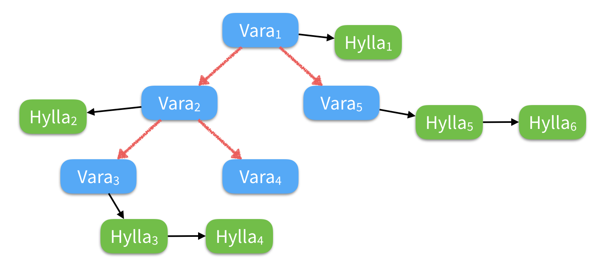

Enkelt lagerhanteringssystem
============================

Denna uppgift går ut på att skriva ett enkelt
lagerhanteringssystem med ett interaktivt användargränssnitt i
terminalen. Det kommer att ta många timmar att skriva färdigt.
I nästa sprint kommer du att *utöka* detta program med nya funktioner.

*OBS!* Du har redan skrivit vissa delar av detta under labbarna.
Nedan beskrivs dessa funktioner *iallafall* -- men det står dig
fritt att återanvända allt ditt `utils`-bibliotek i
detta projekt (och utöka det). 

**TIPS!** Ta fram anteckningspapper och penna. Den här
  specifikationen är lång och det kommer att löna sig att ta
  anteckningar om vad du skall göra. Det ingår alltså i problemet
  som du skall lösa att *förstå problemet*.

**TIPS!** Efter att du har läst igenom denna uppgift kan du också
  titta på sidan om [simple](http://wrigstad.com/ioopm/simple.php)
  som tar denna uppgift som ett löpande exempel på hur man griper
  an ett programmeringsproblem. En work breakdown i olika tasks
  (inkomplett, som inspiration!) finns i [vår Trello](https://trello.com/ioopm).

Systemet skall hålla reda på en "databas" med varor. När
programmet startar går det in i den såkallade "main-loopen" där
användaren får ett antal alternativ:

* Lägga till en vara
* Ta bort en vara **OBS! (1)**
* Redigera en vara
* Ångra senaste ändringen
* Lista hela varukatalogen
* Avsluta

**(1) Behöver inte implementeras förrän i nästa inlupp, men det kan vara värt att fundera över redan nu.**

Main-loopen skriver ut alternativen och frågar vad användaren vill
göra. De olika valen tar användaren ned i olika funktioner (se
nedan) med eget beteende. Efter att sådana funktioner har
avslutats återvänder de till huvudloopen igen. Detta förfarande
fortsätter tills användaren väljer att avsluta programmet.
Exempel:

    Välkommen till lagerhantering 1.0
    =================================

    [L]ägga till en vara
    [T]a bort en vara
    [R]edigera en vara
    Ån[g]ra senaste ändringen
    Lista [h]ela varukatalogen
    [A]vsluta

    Vad vill du göra idag? _

De bokstäver som användaren skall trycka för att välja ett
alternativ står inom klamrar. Stor eller liten bokstav spelar
ingen roll.

Du får gärna ändra på alla kommandon och skriva programmet på
engelska om du vill. Det viktiga är inte att det fungerar *exakt*
med dessa tecken etc., bara att det är uppenbart för användaren
hur systemet fungerar.

En kort film som visar interaktionen med ett liknande
(opolerat) lagerhanteringssystem finns [här](http://wrigstad.com/ioopm/images/lager.gif).


## Generellt för uppgiften

### Hantering av felaktig inmatning

Vid felaktig inmatning skall programmet inte krascha;
istället skall användaren få ett felmeddelande och den aktuella
frågan skall ställas igen. Exempel:

    Mata in nytt pris: asdf
    Felaktig inmatning: 'asdf'
    Mata in nytt pris: tusen
    Felaktig inmatning: 'tusen'
    Mata in nytt pris: 1000

**TIPS!** Hantering av felaktig inmatning är ett bra exempel på
  något som man kan *ducka* (se
  [simple](http://wrigstad.com/ioopm/simple.php)) vid en första
  implementation.

**TIPS!** Det är enkelt att utöka `ask_question()` till att skriva
ut `Felaktig inmatning 'foo'` om kontrollfunktionen returnerar `false`.


### Vara

Varan som vi definierade på labben hade ett **namn**, en
**beskrivning**, ett **pris** och en **lagerhylla** som avser
platsen där den är lagrad:

* Namn och beskrivning skall vara en sträng (`char *`)
* Pris skall vara i ören och är därför ett heltal (`int`)
* Lagerhylla skall vara en bokstav åtföljd av en eller flera
  siffror t.ex. *A25* men inte *A 25* eller *25A*

I denna uppgift skall varan vara i stort densamma, **men** vi vill
också hålla reda på **antalet** varor av denna typ som är lagrad
på den varje hyllplats. Detta kommer att leda till att varan
definieras något annorlunda: vi måste göra en separat strukt för
en lagerhylla och ett antal, och varje vara i databasen kommer att
peka ut en lista med sådana struktar. Det betyder också att
informationen om en vara bara finns sparad en gång i databasen
(alla kritor har samma pris och beskrivning).

Nu har vi mött den stora skillnaden i denna inlämningsuppgift mot
vad som gjordes på labben: hur vi organiserar datat i vår databas.
Vi kommer inte att använda oss av arrayer längre, utan av **träd**
och **listor** som är dynamiska, länkade strukturer. (En länkad
struktur är en som består av en eller flera delar sammanlänkade med
pekare. En dynamisk struktur är en vars storlek kan öka och minska
och vars uppbyggnad kan ändras under programmets körning.)


## Lägga till en vara

Programmet skall fråga användaren efter all den information som en
vara innehåller (se ovan). Om något värde matas in felaktigt
(t.ex. priset var "tusen" och inte "1000") skall ett felmeddelande
skrivas ut och användaren får mata in värdet igen tills det blir
rätt. När samtliga värden matats in skall användaren få en
listning av varan och måste sedan svara på frågan om varan skall
läggas in i databasen eller inte. Svarsalternativen är *Ja*, *Nej*
och *Redigera*. *Ja* lägger till varan, *Nej* avbryter
tilläggningen, och *Redigera* ger möjlighet att redigera
informationen, lämpligen på samma sätt som **Redigera en vara** nedan.
(**Tips!** Kanske inte bara på samma sätt -- utan med hjälp av 
samma kod.)

Varje post i databasen avser en unik lagringsplats. Det går därför
bra att t.ex. lagra hushållspapper både på lagerhylla A25 och B12.
Däremot är det **inte** tillåtet att lagra två *olika* varor på
*samma* lagerhylla, dvs. om det redan finns hushållspapper på A25
får vi inte också lägga kritor på A25. Ett försök att lägga till
en vara där en annan redan finns sparad skall ge upphov till ett
felmeddelande. Det skall heller inte gå att skapa en sådan
situation genom att redigera en vara.


## Visa en vara

Först listas samtliga varors namn med indexnummer:

    1 Hushållspapper
    2 Kritor
    3 Målarfärg

Användaren erbjuds sedan att mata in numret på den vara som hen
vill se, alternativt trycka `a` för avbryta och återgå till
huvudmenyn. Om det finns fler än 20 varor ges också alternativet
att se fler varor. Då visas nästa 20 varor indexerade från 1.

Den valda varan listas på skärmen så här:

    Namn: Hushållspapper
    Beskrivning: Tvålagerspapper med perforering. Varje pappersremsa
    har en liten bild av två blåmusslor som försiktigt vänslas.
    Pris: 20 kr
    Lagerhylla: A25
    Antal: 12

## Redigera en vara

Vara väljs på samma sätt som *Visa en vara*.

När användaren väljer en vara skall varan visas på skärmen.
Användaren får sedan frågan vilken *rad* som skall redigeras:

    [B]eskrivning
    [P]ris
    [L]agerhylla
    An[t]al

    Välj rad eller [a]vbryt: _

Observera att namn inte kan ändras. 
Om användaren matar in t.ex. `p` skall först det gamla priset
skrivas ut och direkt efteråt visas en input för det nya priset:

    Nuvarande pris: 20 kr
    --------------------------------------------------------
    Nytt pris: _


## Lista hela varukatalogen

Varukatalogen listas i bokstavsordning, max 20 varor åt gången:

    1 Hushållspapper
    2 Kritor
    3 Målarfärg

Varje "sida" i listningen rymmer 20 varor. Om det finns fler än 20
varor ges alternativet att se fler varor. Varje vara ges ett
index, som alltid är mellan 1 och 20 och som börjar om på 1 varje
sida.

Ingen detaljinformation om varje vara visas.


## Ångra senaste ändringen

Alla ändringar skall gå att ångra. Det räcker med ångra ett steg
och man kan inte "ångra ett ångrande" eller ångra innan någon
förändring har gjorts i programmet. I både dessa fall skall
meddelandet "Det finns inget att ångra" skrivas ut.

Ett sätt att implementera detta är att för varje händelse med
sidoeffekter (add, remove, edit) spara data som kan återställa
databasen. Så här såg denna datastruktur ut i min implementation
av uppgiften.

```c
struct action
{
  enum { NOTHING, ADD, REMOVE, EDIT } type;
  union
  {
    struct { goods saved; };      // REMOVE
    struct { goods *edited; goods original; }; // EDIT
  };
};
```

**Notera att borttagning kommer först i nästa inlämningsuppgift.**

Här använder jag både `enum`- och `union`-begreppen i C, vilket
kanske är lite tidigt i kursen för de flesta. En enklare variant
är denna:

```c
struct action
{
  int type; // NOTHING = 0, ADD = 1, REMOVE = 2, EDIT = 3
  goods_s *merch;
  goods_s copy;
};
```

Här används `type == 1` för tillägg, `type == 2` för borttag etc.

Varje gång användaren gör något i main-loopen sparar vi
information så att vi kan ångra. Det räcker med en enda variabel
`undo` av typen `struct action`.

Vid tillägg används `merch` för att peka ut vilket värde som lagts
till och `copy` används ej.

Vid borttagning sparas det gamla värdet i `copy` och `merch`
används ej.

Vid edit sparas det gamla värdet i `copy` och `merch` används för
att peka ut det modifierade värdet i databasen.

Om användaren väljer att ångra kan vi se i `undo` vilken typ av
händelse som skall ångras (från `undo.type`). Om vi behöver
återskapa information kan vi titta i `undo.copy`. För att veta vad
som lagts till eller ändrats kan vi använda pekaren i
`undo.merch`.


# Datarepresentationen

Nu beskriver vi en egenskap hos programmet som inte är synlig för
användaren, men är nog så viktig: användning av dynamiska, länkade
strukturer för att hantera programmets minne.

Under labben använde vi en statisk array av `goods` för
att hålla programmets data. Det duger förstås inte i ett riktigt
program eftersom det

1. kräver att vi har ett hårt maxtak på *n* antal varor i
   systemet, och
2. medför att systemet använder minne för *n* antal varor, oavsett
   hur många som faktiskt finns.

I inluppen skall vi skriva lagerprogrammet så att dessa två
problem undviks. Vi kommer att göra det genom att **först skriva
två helt nya delar av programmet** för att hantera en dynamisk
lista av lagerplatser samt ett binärt sökträd av varor (båda dessa
togs upp på PKD). Sedan skall vi ändra i det gamla programmet så
att det använder dem. Analogt med `utils`-bilioteket som du redan
har byggt. 

En schematisk bild över datat:



Trädet består av *Varor* och varje vara har en lista av
*Hyllor* som lagrar information om plats och antal. `Vara2`
finns inte längre i lagret vilket representeras av en tom 
lista. Om vi också ritar ut trädet som håller i alla varor,
samt de listor som håller i varje varas hyllor får vi följande:


Vi ställer följande krav på den nya datastrukturen som skall hålla
i programmets databas:

1. Det skall inte finnas något hårt maxtak på antalet varor i
   systemet (förutom vad som ryms i det lediga minnet).
2. Sökning efter varor skall ske i O(log n) tid (**OBS!** du
   behöver *inte* balansera trädet utan kan förutsätta att indatat
   matas in en en lämplig ordning som ger bra balans).
3. Systemet skall inte använda minne för varor som inte finns (och
   frigöra minne för varor som tas bort), likaså för lagerplatser.

Headerfiler för gränssnitten (alltså listan av funktioner som en
klient kan använda) för lista och träd finns [här](list.h) och
[här](tree.h). Du *skall* använda dessa filer -- det kommer att
underlätta senare under kursen.

**TIPS!** Fundera över vad som är en lämplig moduluppdelning för
programmet så att relaterade funktioner grupperas och
icke-relaterade funktioner inte blandas med varandra.

**TIPS!** Fundera över inkapsling. Vad behöver vara synligt för
programmet? Behöver programmet t.ex. veta något om listorna som
finns sparade i varje nod i trädet?

Sammanfattningsvis:

* Nycklarna i sökträdet är varunamn
* Varor med samma namn anses vara identiska
* Varje vara har informationen från föregående uppgift, och
  dessutom en pekare till en lista med lagerplatser där varan
  finns lagrad
* Listan med lagerplatser innehåller information om vilken
  kvantitet av varan som finns på platsen

För att ett binärt sökträd skall vara korrekt med avseende på
sortering av dess index är det viktigt att det inte går att
modifiera dess nycklar från en annan plats i programmet. Vi
använder varornas namn i detta program -- varje namn representeras
alltså som en array av tecken. Om man ändrar innehållet i en array
`A` från t.ex. `"Anrikare av uran"` till `"Öljetter"` och `A`
används som en nyckel i det binära trädet `T` har man förmodligen
just förstört `T` så tillvida att man inte kan nå öljetterna i
trädet längre (varför?). Ännu värre: vad händer om någon gör
`free(A)` fast `A` fortfarande används av trädet?

För att skydda sig mot denna typ av beteende krävs att nycklarna i
trädet inte är åtkomliga utanför trädet. Det går t.ex. att lösa
genom att skapa en kopia av alla nycklar inuti trädet. Glöm inte
bort att frigöra allt minne som allokeras!

Samma typ av problem uppstår vid redigering av ett namn på en
vara (vilket är varför vi inte skall stödja detta i version 1.0
av detta program). Om du implementerat **borttagning** ur trädet redan nu är
redigering av namn enkelt -- ta bort den den gamla varan, byt namn
och stoppa tillbaka den igen. Om du inte har implementerat
borttagning får du stänga av möjligheten att redigera namnet tills
nästa inlämningsuppgift!


## Funktionen för att lägga till en vara

Det program som vi byggde på den sista labben tillät en vara att
vara lagrad flera gånger i databasen på olika platser. I och med
skiftet till ett binärt sökträd kommer en vara nu enbart finnas
lagrad en gång. När man lägger till en vara fler än en gång
manipuleras nu den länkade listan med lagerplatser.

Exempel: För att lägga till ett antal minecraftsvärd på flera
lagerplatser kan du först lägga till varan på precis samma sätt
som på labben. Användaren märker ingen skillnad men internt sparas
svärden i trädet `T` med en lista `L` av lagerplatser vars längd
kommer att vara ett (1) initialt. Nästa gång varan läggs till
måste systemet se att varan redan finns. Denna kontroll sker
lämpligen efter att namnet matas in genom en sökning i `T`. Om
varan redan finns behöver vi inte fråga efter beskrivning eller
pris. Istället frågar vi bara om lagerplats och kvantitet och
uppdaterar `L` med den informationen.

Så här kan man tänka sig att interaktionen med användaren ser ut
(text inom `<`vinkelparenteser`>` avser text som användaren matat in).

    Vad vill du göra idag? <L>

    Lägg till vara
    ==============

    Namn: <Minecraftsvärd>

    Minecraftsvärd finns redan i databasen.
    Använder samma pris och beskrivning.

    Lagerplats: <C12>
    Antal: <350>


Om samma lagerplats används flera gånger aggregeras varorna på
denna plats.


## Tips: omdirigering av stdin för att testa programmet

I UNIX-miljö kan indata till ett program komma från en textfil.
När programmet körs läses svaren till programmets frågor från en
fil istället för att matas in för hand. Detta kommer att vara
nyttigt för att testa ditt program i denna uppgift eftersom det
kommer att krävas många inmatningar för att fylla programmet med
intressant data.

Du kan t.ex. pröva att styra en minimal interaktion med programmet
så här:

1. Skapa en fil `test.txt` med innehållet `q` och en radbrytning.
   (`q` för att avsluta programmet -- byt till annat tecken om du
   gjort ändringar.)
2. Kör programmet så här: `./myprog < test.txt` där `myprog` är
   det kompilerade programmet.

Nu kan du pröva att ändra i `test.txt`. T.ex. så här:

```
L
Kritor
Vita kritor
20
C4
h
q
```

Detta skall lägga till en vara (kritor), lista hela varukatalogen,
och sedan avsluta. (Notera att ditt program kanske tar emot indata
i en annan ordning!)


# Implementation

Här följer några tips för implementationen.

* Ett bra sätt att implementera ett program är att göra det i
  olika diskreta steg, "inkrement", där varje steg för någon eller
  några delar av implementationen framåt.
* Du kan modularisera -- t.ex. skriva hela listan, sedan hela trädet
  och sedan uppgiften "ovanpå" dessa (du har redan en bra start i
  `db.c`) -- eller arbeta top-down där du först skriver gränssnittet,
  och steg för steg kopplar på funktioner som hanterar den faktiska
  logiken i programmet.
* En strukt `goods` är en central datatyp vars definition går att
  extrahera ur ovanstående. Likaså strukten för varor sparade på
  en lagerhylla. Samt träd och listor.
* Det är lämpligt att ha en funktion per alternativ i huvudloopen
  och som ställer alla relevanta underfrågor. Vi kallar dessa för
  gränssnittsfunktioner och de kan vara till exempel:
  - `add_goods` -- lägga till vara
  - `remove_goods` -- ta bort vara (räcker med en **stub** i denna inlupp)
  - `edit_goods` -- redigera vara (se not ovan om redigering av namn)
  - `list_goods` -- lista hela varukatalogen
  - `display_goods` -- visa en specifik vara
  - `undo_action` -- ångra
  - `exit_program` -- avsluta programmet
* Blanda inte *gränssnittslogik* med *varulogik*, dvs. `add_goods`
  huvuduppgift är att visa alternativ för användaren, och ställa
  frågor i rätt ordning, etc. -- men all logik för att visa varor,
  kolla vad som är lagrat på en specifik lagerhylla, etc. sker i
  specika funktioner, som förmodligen kommer att användas av flera
  gränssnittsfunktioner. (I ett senare skede i programmets
  utveckling skulle vi förmodligen separera gränssnittslogik och
  varulogik i två olika moduler.)
* Återkommande uppgifter bör brytas ut och läggas i separata
  funktioner. Ett typiskt sådant standard-mönster som programmet
  upprepar är att ställa en fråga tills ett lämpligt svar har
  tagits emot. För enkelhets skull kan vi implementera flera
  frågor för olika typer av förväntat indata. (I ett senare skede
  i utvecklingen kanske vi skulle slå samman dem till en enda och
  mer flexibel funktion.) Till exempel:
  - `ask_question_string` -- förväntar sig svar i form av hela
    strängar (t.ex. namn på vara eller beskrivning av vara)
  - `ask_question_int` -- förväntar sig ett svar i form av ett
    heltal (t.ex. priset på en vara)
  - `ask_question_char` -- förväntar sig ett svar i form av ett
    enskilt tecken (t.ex. ett alternativ som användaren
    presenteras för)
* Ytterligare ett exempel på ett lämpligt beteende som bör ges en
  egen funktion är att skriva ut en vara på terminalen,
  `print_goods`, något som sker flera gånger i olika skeden av
  programmet.
* Både `add_goods` och `edit_goods` kommer att behöva en funktion
  som kontrollerar *vad* som finns lagrat på en specifik
  lagerhylla, för att uppfylla kravet att enbart en vara finns per
  lagerhyllsplats. Till exempel funktionen
  `get_goods_for_storage_location`.


## Ett par lämpliga första steg

Se [simple](http://wrigstad.com/ioopm/simple.php) för en mer
detaljerad diskussion.

1. Börja med att skriva `ask_question_char` och använd den för att
   implementera programmets huvudloop. På detta vis har du alltid
   ett program som går att köra och det underlättar både
   utveckling och testning.
2. Definiera struktarna för varuinformation och varor sparade på
   hyllplatser. Skriv en funktion som lägger till
   några exempelvaror i databasen genom att direkt skriva till den
   array (eller motsvarande) som håller datat. Detta vill vi göra
   för att nästa två steg skall kännas meningsfulla och gå att
   testa. (Observera att en stor del av detta är gjort på labbarna.)
3. Implementera `display_goods` vilket kommer att leda till att du
   måste implementera flera hjälpfunktioner, t.ex. `print_goods`.
4. Implementera `list_goods`.
5. Fortsätt med `edit_goods`. För denna funktion behövs
   `get_goods_for_storage_location` så att du kan kontrollera att
   lagringsplatserna för varje vara är unika.
6. Nu borde du kunna implementera `add_goods` tämligen enkelt och
   mestadels förlita dig på de hjälpfunktioner du redan har.


# Frivilliga utökningar

För dig som vill sitta och pilla med uppgiften och vill göra mer.
(Eller vill göra en utökning för att redovisa fler mål.)

1. Stöd för att ångra flera steg.
2. Hitta dyraste respektive billigaste varan.
3. Skriv ut försäkringsvärdet, dvs. totalsumman av pris x antal
   för alla varor.
4. Omorganisera lagret genom att slå samman alla varor av samma
   typ och lägga dem på samma hyllplats.
5. Möjlighet att välja sorteringsordning vid utskrift av varor
   (bokstavsordning angivet ovan, men man kan tänka sig hyllplats,
   pris stigande, pris fallande, etc.).
6. Söka efter en viss vara och få ut alla hyllplatser där den finns.
7. Stöd för att lägga varor i olika kvantiteter i en "korg" vars
   kostnad skall visas vid varje interaktion med användaren; det
   skall vara möjligt att lägga varor i korgen, ta bort dem ur
   korgen (då hamnar de på hyllan igen), och tömma korgen.
8. Stöd för storlekar. Varje hyllplats rymmer bara ett visst antal
   kubikcentimeter och varubegreppet utökas med en storlek i
   kubikcentimeter. Se till att varorna får plats genom att tvinga
   användaren att bryta upp stora varukvantiteter över flera
   hyllplatser.
9. Stöd för kompaktering, dvs. omorganisera lagret så att en vara
   är lagrad på angränsande hyllplatser.
10. Skriv enhetstester för dina funktioner (detta kommer som ett
    krav i nästa utökning).
11. Stöd fär skiftlägesokänslighet vid inmatning av vara. Det vill
    säga, "kritor", "Kritor", "KRITOR" är samma vara.
12. Vid inmatning av existerande vara, lista existerande lagerplats
    och kvantitet.
13. Balansera binärträdet av varor.
14. Stöd för att byta namn på en vara. Om man byter namn på en vara
    `V1` till ett redan existerande namn på en vara `V2` skall man få
    frågan om man vill slå ihop posterna. Då flyttas alla
    lagerplatser från `V1` till `V2` och `V1` tas bort ur databasen.
15. Utöka stödet för att ångra till att omfatta alla förändringar
    och utökningar som du har gjort, samt implementera "ångra
    ångra" (aka redo).


# Förslag på mål att redovisa

Du använder uppgiften till att redovisa mål -- när du redovisar
ett mål skall det finnas en tydlig koppling till uppgiften eller
någon föreslagen utökning till uppgiften. Det ingår i uppgiften
(eller egentligen i hela kursupplägget) att förstå mappningen från
uppgift (eller del av uppgift) till lämpliga mål. Vi ger förslag
-- färre och färre ju längre in i kursen vi kommer. Notera att det
inte räcker med att bara följa förslagen för att bli godkänd.

1. [Inluppsmål 1](http://auportal.herokuapp.com/achievements/100)
2. [G15](http://auportal.herokuapp.com/achievements/15) -- ett måste vid inläsning med hjälp av en buffert. Vad kan hända annars?
3. [H20](http://auportal.herokuapp.com/achievements/20) -- vad är det för skillnad på att skicka in/returnera ett heltal respektive en sträng till/från en funktion? Kan relateras till ovanstående mål.
4. [M36](http://auportal.herokuapp.com/achievements/36) -- vid interaktion eller iteration över databasen, t.ex.
5. [W57](http://auportal.herokuapp.com/achievements/57) -- speciellt om du delar upp programmet i flera filer
6. [A1](http://auportal.herokuapp.com/achievements/1) -- genomgående inslag i denna uppgift
7. Börja på [C7](http://auportal.herokuapp.com/achievements/7) -- du vill inte behöva efterskapa saker sedan (**Du kan alltså inte redovisa detta redan nu.**)
